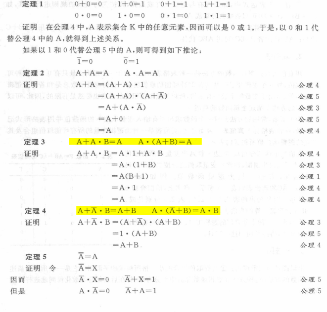
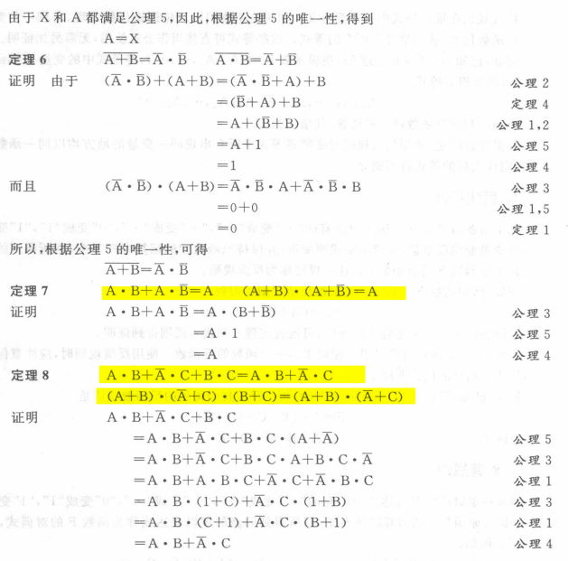
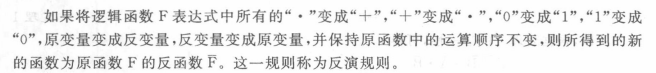
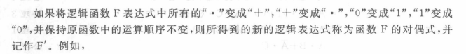

# 第二章

## 各种公式

### 反演规则

### 对偶规则

对偶规则在推导公式的时候比较有用，反演规则意义不大，除非题目要求求出反函数。

## 标准与或和或与表达式

### 代数转换法

### 真值表转换法（简单无脑yyds）

1 -> m

0 -> M

## 最简与或和或与表达式

### 代数转换法

### 卡诺图

先转为与或式，转换成与或关注1项，正为1，非为0；转换为或与关注0项，正为0，非为1。如果是或与表达式可以先求出反函数在进行。

